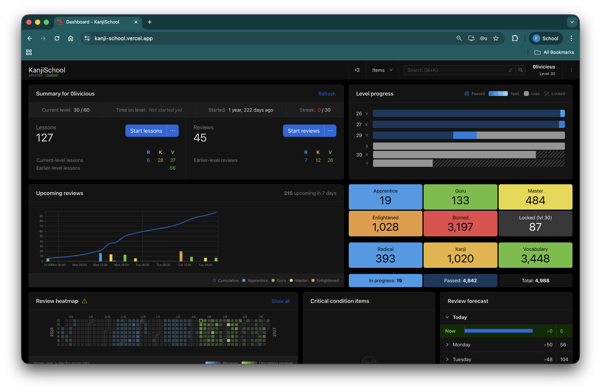
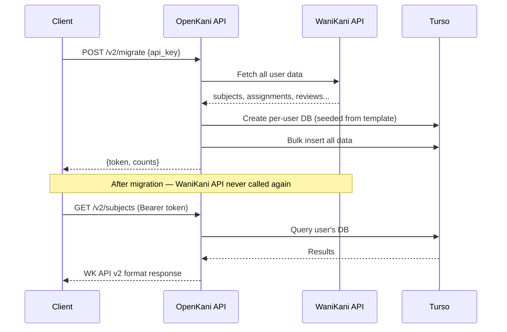

<h1 align="center">
  🦀 OpenKani
</h1>

<p align="center">
  <strong>Self-hosted WaniKani backend. Own your data, zero API calls after migration.</strong>
</p>

<p align="center">
  <a href="LICENSE"></a>
  
  
  
  
</p>

<p align="center">
  
</p>

---

Migrate your WaniKani progress once → all data lives in your own Turso SQLite databases → every request stays on your infra. Works with forked clients on web, iOS, and Android.

> **Runs entirely on free tiers** — Vercel Hobby + Turso Starter. No credit card needed.

## Try it now

No deploy needed — use the public instance to test:

| | URL |
|---|---|
| **API** | [openkani.vercel.app](https://openkani.vercel.app) |
| **Web client** | [kanji-school.vercel.app](https://kanji-school.vercel.app) |

Go to [kanji-school.vercel.app](https://kanji-school.vercel.app), enter your WaniKani API key, and start using it immediately. Deploy your own instance later if you want full control.

## Why OpenKani?

There is **no other open-source, self-hosted WaniKani backend** with API v2 compatibility. Here's how alternatives compare:

| | OpenKani | WaniKani | Anki | Kanji Koohii | KaniWani |
|---|---|---|---|---|---|
| Self-hosted | ✅ | ❌ | ✅ (sync server) | ✅ | ❌ |
| WK API v2 compatible | ✅ | ✅ (source) | ❌ | ❌ | Partial |
| Structured kanji curriculum | ✅ | ✅ | ❌ | RTK only | ❌ (reverse only) |
| SRS built-in | ✅ | ✅ | ✅ | ✅ | ✅ |
| Per-user isolated DB | ✅ | ❌ | ❌ | ❌ | ❌ |
| Mobile clients | ✅ | ✅ | ✅ | ❌ | ❌ |
| Free forever | ✅ | ❌ ($9/mo) | ✅ | ✅ | ✅ |
| Migrate existing progress | ✅ | — | ❌ | ❌ | ❌ |

**Key differentiators:**
- **One-time migration** — import all WK data, never call their API again
- **Per-user SQLite** — each user gets an isolated Turso database, not shared tables
- **Drop-in clients** — forked KanjiSchool (web), Tsurukame (iOS), Smouldering Durtles (Android) point at your backend
- **Free deployment** — Vercel free tier + Turso free tier (100 DBs, 9GB storage)

## How it works



## Quick start

**Prerequisites**: [Bun](https://bun.sh) >= 1.0, [Turso CLI](https://docs.turso.tech/cli/installation)

```bash
# 1. Setup Turso (one-time)
turso auth api-tokens mint openkani          # platform API token
turso group create openkani                  # DB group
turso group tokens create openkani           # group auth token
turso db create wani-template --group openkani
turso db create wani-registry --group openkani

# 2. Clone & configure
git clone https://github.com/sarmientoF/OpenKani.git
cd OpenKani
bun install
cp .env.example .env                         # fill in Turso creds

# 3. Push schemas & run
bun run db:push:template
bun run db:push:registry
bun run dev                                  # http://localhost:3000
```

> Full setup details in [docs/SETUP.md](docs/SETUP.md)

## Deploy to Vercel

### API

[](https://vercel.com/new/clone?repository-url=https%3A%2F%2Fgithub.com%2FsarmientoF%2FOpenKani&env=TURSO_API_TOKEN,TURSO_ORG,TURSO_GROUP,TURSO_DATABASE_NAME,TURSO_REGISTRY_DATABASE_NAME,TURSO_GROUP_AUTH_TOKEN&envDescription=Turso%20credentials%20for%20the%20OpenKani%20API&project-name=openkani-api&repository-name=openkani-api)

### Web client

[](https://vercel.com/new/clone?repository-url=https%3A%2F%2Fgithub.com%2FsarmientoF%2FOpenKani&env=VITE_API_URL&envDescription=URL%20of%20your%20deployed%20OpenKani%20API%20(e.g.%20https%3A%2F%2Fopenkani.vercel.app)&project-name=openkani-web&repository-name=openkani-web)

Set `VITE_API_URL` to your deployed API URL (e.g. `https://openkani.vercel.app`).

> Both run on **Vercel's free Hobby plan**. See [docs/SETUP.md](docs/SETUP.md) for env var details.

## Clients

| App | Platform | Submodule |
|-----|----------|-----------|
| KanjiSchool | Web (React) | `apps/kanji-school` |
| Tsurukame | iOS (Swift) | `apps/tsurukame` |
| Smouldering Durtles | Android (Java) | `apps/smouldering_durtles` |

```bash
git submodule update --init --recursive
```

## Stack

**Backend**: Bun · Hono · Drizzle ORM · Turso (per-user libSQL) · Zod
**Web**: React 18 · Vite · Redux Toolkit · Ant Design · Dexie (IndexedDB)
**Hosting**: Vercel (Node.js via `@vercel/hono`)

## Roadmap

- [x] Web client ([KanjiSchool](https://kanji-school.vercel.app))
- [ ] iOS client release (Tsurukame fork)
- [ ] Android client release (Smouldering Durtles fork)
- [ ] [Open Claw](https://github.com/sarmientoF/OpenClaw) plugin support

## Docs

- [Setup & Deployment](docs/SETUP.md) — full env var reference, Turso setup, Vercel config
- [API Reference](docs/API.md) — all endpoints, request/response formats
- [Architecture](docs/ARCHITECTURE.md) — per-user DB pattern, schema design, migration flow
- [Contributing](CONTRIBUTING.md) — dev setup, PR guidelines

## License

[MIT](LICENSE)
