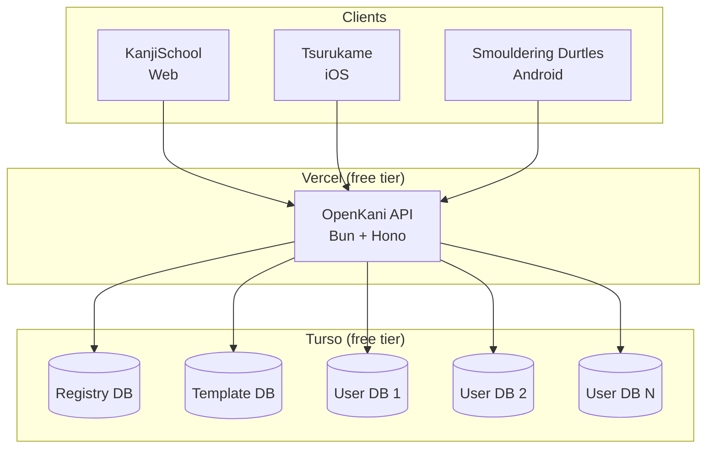

# Architecture

## Overview



## Per-user database pattern

Each user gets an **isolated SQLite database** on Turso. No shared tables, no row-level filtering.

```
User signs up (POST /v2/migrate)
  → md5(userId) → DB name
  → Turso Platform API creates DB (seeded from template)
  → DB lives at: libsql://md5(userId)-{org}.turso.io
```

**Why per-user DBs?**
- Complete data isolation — no leaks between users
- Delete a user = delete a database
- No row-level security needed
- Each DB is small (~2-5MB), fits Turso free tier (100 DBs, 9GB)

### Auth flow

```
Request with Bearer token
  → auth middleware looks up token in registry DB
  → gets userId
  → resolves per-user DB via md5(userId)
  → injects db connection into request context
```

## Denormalized schema

Single `subject` table (~61 columns) merges:
- Subjects (radicals, kanji, vocabulary)
- Assignments (SRS stage, unlock/start dates)
- Review statistics (correct/incorrect counts)
- Study materials (notes, synonyms)

**Why denormalized?**
- Matches mobile SQLite format (Tsurukame, Smouldering Durtles use similar schemas)
- Fewer joins — single query returns everything a client needs
- Simpler migration — one batch insert per subject

Other tables:
- `srsSystem` — SRS stage definitions and intervals
- `levelProgression` — level-up history
- `properties` — user profile data

## Project structure

```
src/
├── index.ts                   # Hono app + Bun/Vercel entrypoint
├── routes.ts                  # Route registration
├── helpers.ts                 # Response formatting utilities
├── env.ts                     # Env validation (Zod)
├── transformers.ts            # DB row → WK API response transforms
├── db/
│   ├── schema.ts              # Drizzle schema (denormalized subject table)
│   └── registry-schema.ts     # Registry DB schema (users table)
├── middleware/
│   ├── auth.ts                # Bearer token → userId → per-user DB
│   └── logger.ts              # JSON structured request logger
├── routes/                    # Route handlers per resource
├── schemas/                   # Zod request validation schemas
└── services/
    ├── turso.service.ts       # Per-user DB creation & connection caching
    ├── registry.service.ts    # Token ↔ userId mapping
    ├── migration.service.ts   # WaniKani → Turso bulk import
    ├── migration.transform.ts # WK data → DB row transforms
    ├── review.service.ts      # SRS logic, level-up, burns
    └── wanikani-api.ts        # WaniKani API v2 client
```

## SRS logic

Reviews update SRS stage based on incorrect answers:

- **0 incorrect** → stage + 1
- **1+ incorrect** → stage - (incorrect_adjustment based on stage)
- **Stage 5+** → "passed" (guru)
- **Stage 9** → "burned" (retired)

Level-up triggers when all kanji at current level reach "passed" status. New subjects unlock automatically.

## Migration flow

```
POST /v2/migrate {api_key}
  1. Fetch from WK API: subjects, assignments, review_statistics,
     study_materials, level_progressions, user, srs_systems
  2. Create per-user Turso DB (seeded from template)
  3. Merge subjects + assignments + review_stats + study_materials
     into denormalized rows
  4. Batch insert (500 rows/batch)
  5. Insert level progressions, SRS systems, user properties
  6. Register token → userId in registry DB
  7. Return {token, counts}
```
